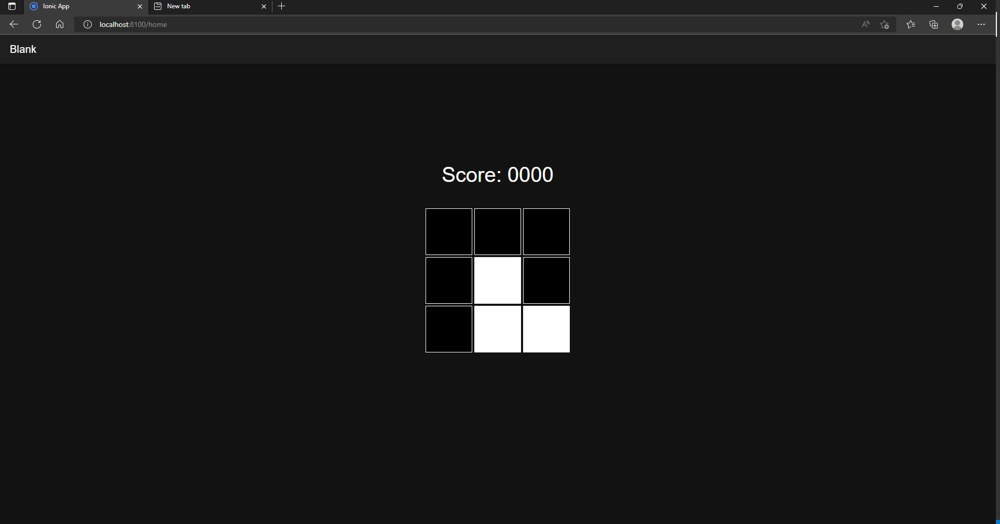
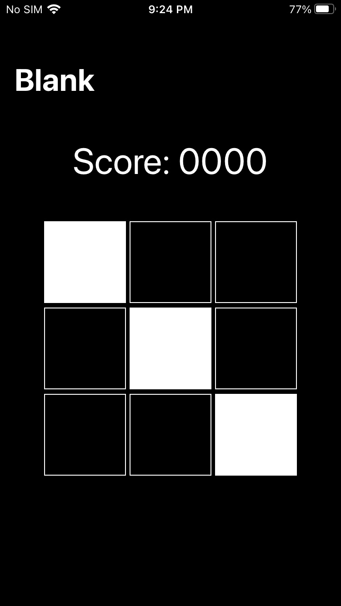
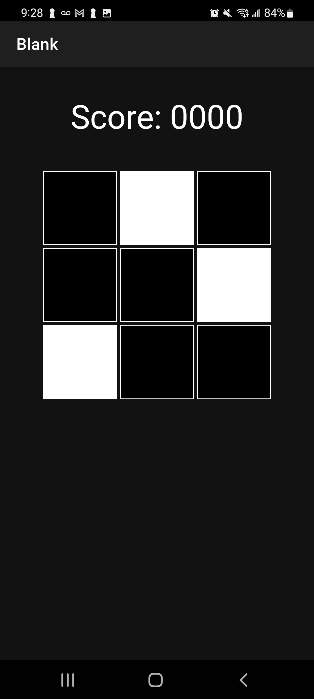
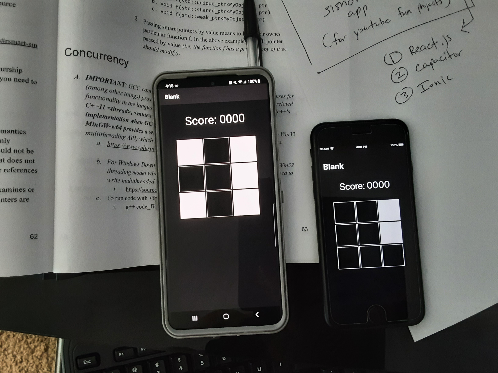

# first_ionic_project

This is the first application that I've created using the Ionic Capacitor framework with React.js

It is also the very first cross-platform / progressive-web-app (PWA) that I've ever created. 

# Video 
Checkout the YouTube video devlog for this project. 

https://www.youtube.com/watch?v=C-sWPVyGKtw&t=19s 

# Concept

The concept for this application is very simple. It generates a pattern of white squares that you have to memorize within 1 second and then recreate after the pattern is cleared. After every successful set of recreated patterns that you enter, the app will generate a new pattern. It will keep appending a new pattern to the sequence of existing patterns for you to recreate until you mess up. It is a similar idea as the old Simon color game.

# Screenshots

The screenshots below shows the app running on iOS, Android, and Web.

 -----------
 

 
 

 
